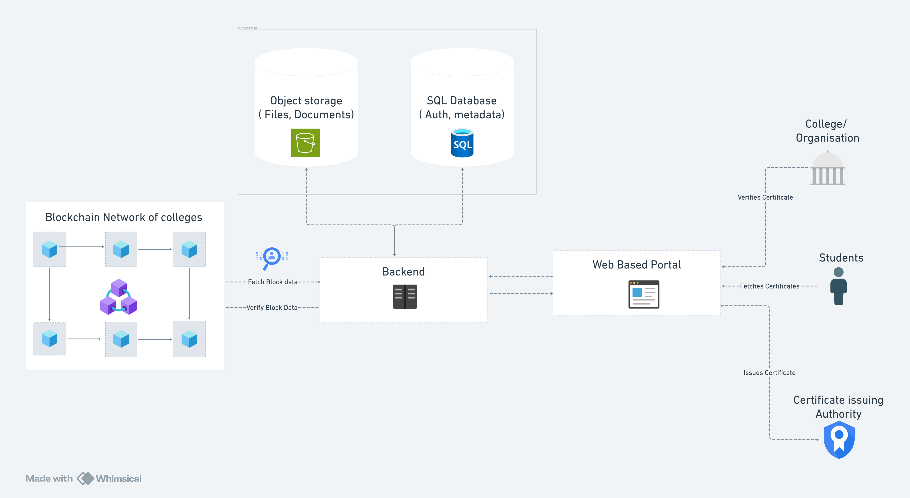

> ### ⚠️ Warning: This Project is not live yet and is for demo purposes only

# 🎓 Decentralized Academic Credential Verification

🎯 *"Bringing trust, security, and efficiency to academic credential verification through blockchain."* 🚀

### 📌 **Overview**
The current degree verification system is **slow, expensive, and prone to fraud**. Employers and institutions struggle with verifying academic credentials, leading to inefficiencies and trust issues.

This project aims to **eliminate fake certificates and enable instant verification** through a **private Ethereum-based blockchain**, where **each college runs its own node** and issues tamper-proof certificates.

Unlike traditional centralized databases, this system ensures **decentralized, trustless, and immutable** credential verification, reducing dependency on third-party validation authorities.

🔹 **Why This Matters:**
- **10M+ degrees issued annually** in India, yet verification is **slow and costly**.
- **2,500+ fake degree fraud cases** reported annually, leading to **hiring risks**.
- **Manual verification takes weeks**, delaying recruitment and administrative efficiency.
- **No unified system**, forcing employers to rely on individual institutions.

With blockchain, we provide a **secure, instant, and cost-effective solution** that empowers colleges, students, and employers.

---

## 🏗 **Architecture**

This system consists of multiple **colleges running their own blockchain nodes** while remaining part of a **shared, permissioned Ethereum-based network**. Each college independently issues degrees using **smart contracts**, and verification happens via a decentralized lookup mechanism.

---

## 🚀 **Features**
✅ **Decentralized & Trustless** – No central authority required; colleges manage their own credentials.  
✅ **Immutable & Fraud-Proof** – Certificates stored on blockchain cannot be altered.  
✅ **Instant Verification** – Employers and institutions can verify degrees in seconds.  
✅ **Cost-Efficient & Scalable** – Each college stores only ~2GB of data per year.  
✅ **Zero-Knowledge Proof (ZKP) Based Privacy** – Data remains private while still being verifiable.  
✅ **Fault-Tolerant** – If a college node goes offline, it syncs back automatically when restored.  
✅ **Interoperable & Extensible** – Can be integrated with existing university systems, government agencies, and HR databases.

---

## 🔧 **Tech Stack**
### **Blockchain Clients**
- **Nethermind** – Execution client
- **Lighthouse** – Consensus client (PoA - IBFT 2.0)
- **Geth Bootnode** – For peer discovery

### **Smart Contracts & Backend**
- **Solidity** – Smart contract development
- **Hardhat** – Smart contract deployment & testing
- **NestJS / Spring Boot** – Backend API
- **Ethers.js** – Blockchain interaction

### **Frontend**
- **Remix / React** – Certificate verification interface

### **Database (Off-Chain Storage)**
- **PostgreSQL / MongoDB** – Storing additional certificate details
- **IPFS (Optional)** – Decentralized document storage

---

## 📊 **Storage & Cost Analysis**
- **On-Chain Storage Growth** → ~2GB per college per year.  
- **10-Year Projection** → ~20GB per college.  
- **Total Network-Wide Storage** → **If 1000 colleges join, total blockchain data = ~2TB/year**.  
- **Estimated Cost Per College** → $800 – $3000 per year.  
- **Projected Network Costs** → If fully adopted across **45,000+ institutions**, the total cost remains **scalable and manageable**, ensuring broad adoption potential.

---

## 🙌 **Contributing**
This is a **hackathon project**, and contributions are welcome for improving the demo. Submit a pull request or open an issue for discussions.

---

## 📩 **Contact**
For inquiries, reach out at: **uic.24mca20282@gmail.com**

---

